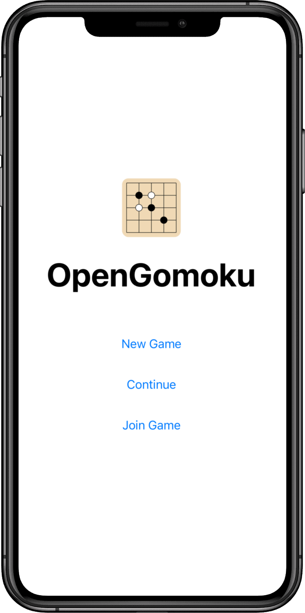
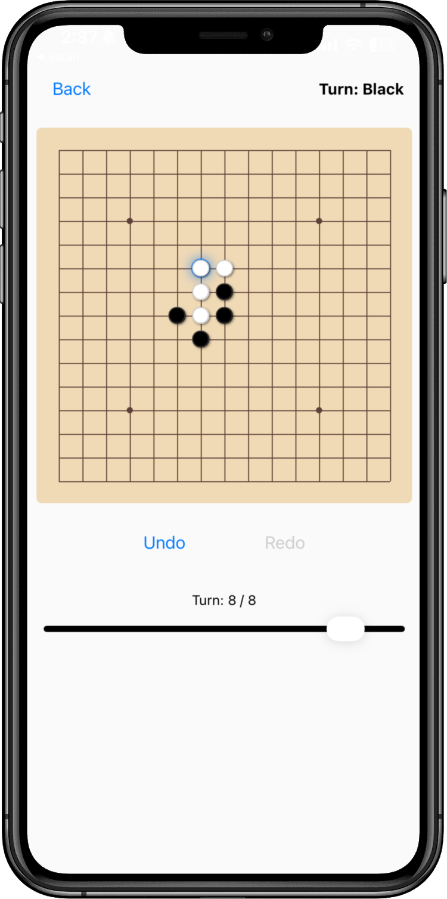

# Gomoku React Native App

  

A simple Gomoku (Five in a Row) game built with React Native and Expo. Supports online multiplayer via a lightweight Flask backend.

  
  

## Features

*   **Game Modes**: Play against a computer (PvC) or another player (PvP) on the same device.
*   **AI Difficulty**: Choose between 'Easy' (Random) and 'Medium' (Heuristic) AI.
*   **Game Controls**: Undo, Redo, and a History Slider to review and resume from past moves.
*   **Persistence**: The game automatically saves your progress so you can continue later.

## Installation

You can install the game on Android devices from the APK file in [`GomokuApp/releases/GomokuApp.apk`](https://github.com/dabslee/Board-Games/raw/refs/heads/master/GomokuApp/releases/GomokuApp.apk).
